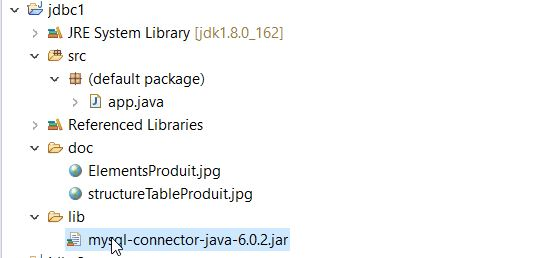
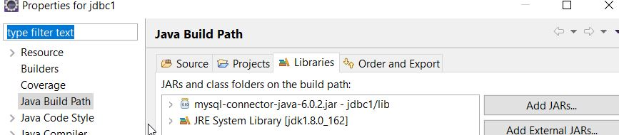
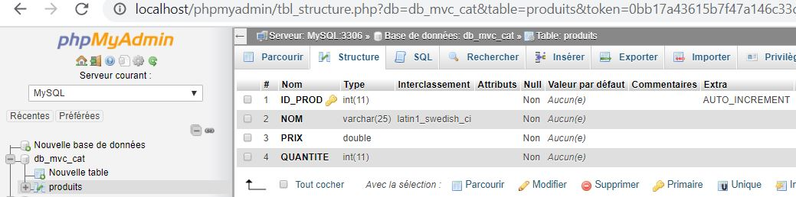
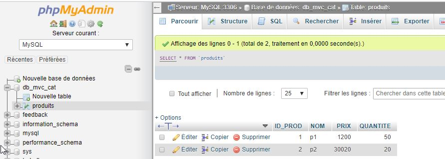
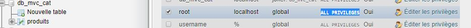

# JDBC mysql


## A)  Configuration du projet

### 1)  Création du répertoire lib et copie du jar file jdbc

Ici nous utilisons la version jar du driver  **mysql-connector-java-6.0.2.jar**



### 2) Configuration du BuildPath du projet sous eclipse



## B) Configuration de Mysql 

Creation d'une base de données **db_mvc_cat** et la creation d'une table **produit**

- Structure de la table **produit** avec **ID_PROD** qui est défini en auto-incrément


- Éléments de la table **produit**


- Utilisation du compte root de mysql avec les droits de base.  Ici les appelles vers la base sont effectués en local à la base de données.



## C)  Run de l'application

Résultat 

```bash
ctlgs  =  db_mvc_cat
ctlgs  =  feedback
ctlgs  =  information_schema
ctlgs  =  mysql
ctlgs  =  performance_schema
ctlgs  =  sys
ctlgs  =  tododb
p1
p2
```

